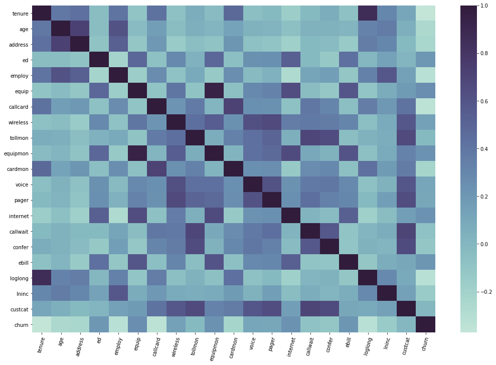
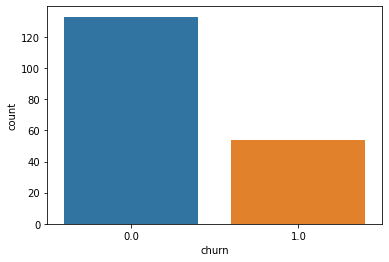
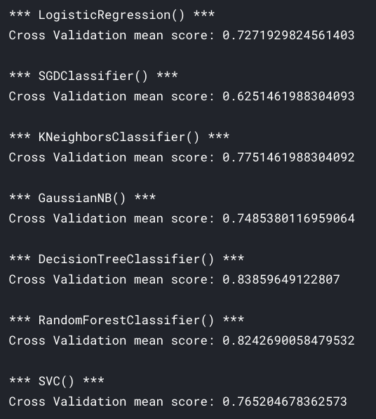
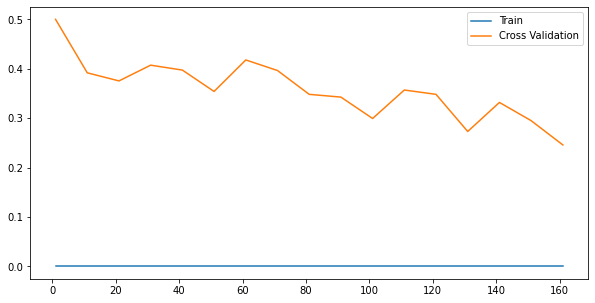
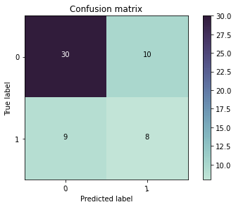
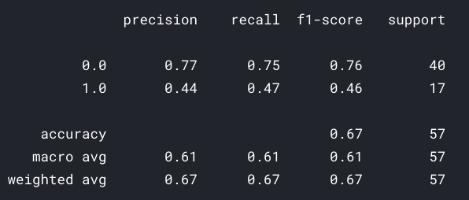

# classify-customer-churn

Here [CustomerChurnRate](https://www.kaggle.com/gangliu/customerchurnrate) dataset by [Gang Liu](https://www.kaggle.com/gangliu) is used classify whether a customer is going to churn or not. Using the dataset `EDA` is done.

**While doing this we'll**

- Deal with `outliers` using the `iqr` and `z-scores` methods
- Feature selection using `backward elimination`

## Table of contents

- [Getting started](#getting-started)
- [EDA](#eda)
- [License](#license)

## Getting started

The [notebook](https://www.kaggle.com/akashsdas/classify-customer-churn) is available on Kaggle to work in the same environment where this notebook was created i.e. use the same version packages used, etc...

## EDA

**Correlation matrix**

**Count plot (how unbalanced the dataset is)**

## Model performance

**Cross validation scores for different models**

**Learning curve**

**Confusion matrix, without normalization**

## License

[APACHE LICENSE, VERSION 2.0](./LICENSE)
